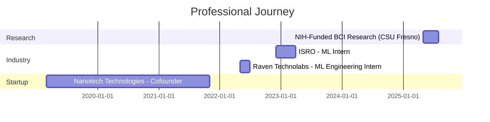

<div align="center">

<!-- Dynamic Header with Gradient Wave -->


<!-- Animated Typing Effect -->


<!-- Social Badges with Hover Effects -->
<p>
  <a href="https://aryanp-portfolio.netlify.app" target="_blank">
    
  </a>
  <a href="mailto:aryanpatodiya018@gmail.com">
    
  </a>
  <a href="https://www.linkedin.com/in/aryanpatodiya08/" target="_blank">
    
  </a>
  <a href="https://github.com/Aryanp018" target="_blank">
    
  </a>
</p>

<!-- Profile Views Counter -->


</div>

---

## 🚀 About Me

```python
class AryanPatodiya:
    def __init__(self):
        self.role = "AI/ML Engineer & Researcher"
        self.education = "MS in Computer Science @ CSU Fresno"
        self.location = "Fresno, CA"
        self.focus_areas = [
            "Reinforcement Learning",
            "RAG Optimization", 
            "Cloud-Native AI Systems",
            "LLM Fine-tuning & Deployment"
        ]
        
    def current_work(self):
        return {
            "research": "NIH-Funded BCI Research (98.7% accuracy)",
            "project": "GRPO-based RAG optimization with RL",
            "interests": ["Scalable ML Systems", "MLOps", "Distributed Computing"]
        }
    
    def past_achievements(self):
        return [
            "🛰️ ISRO: 20% improvement in rainfall prediction",
            "🧠 NIH BCI: 98.7% classification accuracy",
            "☁️ Production ML pipelines with AWS/K8s/Triton",
            "📊 Real-time analytics serving 1000+ concurrent users"
        ]
```

<div align="center">

### 💡 **Quick Highlights**

</div>

<table align="center">
<tr>
<td align="center" width="50%">

**🎓 Education**
- **MS Computer Science** - CSU Fresno (3.9 GPA)
- **BTech Computer Engineering** - CSUT India (3.82 GPA)

**🏢 Experience**
- Machine Learning Research @ CSU Fresno (NIH-funded)
- ML Intern @ ISRO (Hydrological Modeling)
- ML Engineering Intern @ Raven Technolabs
- Cofounder & Lead Engineer @ Nanotech Technologies

</td>
<td align="center" width="50%">

**🔬 Research Focus**
- Reinforcement Learning for RAG Systems
- Brain-Computer Interfaces (98.7% accuracy)
- Probabilistic Forecasting Models
- Distributed ML Systems

**🎯 Currently Working On**
- GRPO-based RL for RAG optimization
- Reducing LLM hallucinations by ~25%
- Scalable BCI preprocessing pipelines

</td>
</tr>
</table>

---

## 🛠️ Tech Arsenal

<div align="center">

### **Languages & Core**


### **AI/ML Frameworks**


### **MLOps & Model Serving**


### **Cloud & Infrastructure**


### **Data Engineering**


### **Databases**


### **Tools & Development**


</div>

---

## 🎯 Featured Projects

<div align="center">

<table>
<tr>
<td width="50%">

### 🤖 **RAG Optimization with RL**
**Ongoing Research**

- GRPO-based reinforcement learning framework
- ~25% reduction in hallucination rates
- Hybrid reward mechanisms for factuality
- Evaluation on SQuAD & Natural Questions
- BLEU, ROUGE-L, BERTScore metrics

**Tech:** PyTorch • Transformers • FAISS • RL

</td>
<td width="50%">

### 🧠 **Brain-Computer Interface**
**NIH-Funded Research @ CSU Fresno**

- 98.7% balanced accuracy (AUC: 0.9997)
- 64k+ multi-channel EEG trials processed
- 40% reduction in preprocessing time
- CNN with temporal-spatial convolutions
- 25% improvement in model robustness

**Tech:** Python • MATLAB • TensorFlow • CNN

</td>
</tr>

<tr>
<td width="50%">

### 📈 **MarketPulse**
**Real-Time Stock Analytics** | [GitHub](#)

- LSTM/GRU models: 80% directional accuracy
- Vector DB + embeddings: 20% faster queries
- Production AWS deployment
- TensorFlow Serving for real-time inference
- Scalable data pipeline architecture

**Tech:** AWS • TensorFlow • LSTM • Vector DB

</td>
<td width="50%">

### 📄 **DocuQuery**
**Multimodal Semantic Search**

- LLaMA-2 + FAISS retrieval system
- 30% improvement in search relevance
- OpenAI embeddings for multimodal data
- Dockerized microservice deployment
- Streamlit-based user interface

**Tech:** LLaMA-2 • LangChain • FAISS • Docker

</td>
</tr>

<tr>
<td width="50%">

### ⏰ **TimeNet**
**Sequence Forecasting Framework**

- 15-20% improvement over ARIMA
- Cross-domain time-series forecasting
- PyTorch DataPipes optimization
- 20% faster training pipeline
- Rainfall & energy predictions

**Tech:** PyTorch • TensorFlow • RNN • LSTM

</td>
<td width="50%">

### 🎮 **Duck Hunt 3D**
**OpenGL Game Engine**

- ~60 FPS with optimized rendering
- Parallax environments & pathfinding
- Collision detection system
- Audio-visual subsystem integration
- Custom physics engine

**Tech:** OpenGL • C++ • Game Physics

</td>
</tr>
</table>

> 🚀 **More repositories coming public soon!** Follow for updates.

</div>

---

## 📊 GitHub Analytics

<div align="center">


### 🏆 **GitHub Trophies**


</div>

---

## 💼 Work Experience Timeline



<details>
<summary><b>🔍 Click to expand detailed experience</b></summary>

### 🧠 **Machine Learning Research Assistant** - CSU Fresno
*NIH-R15 Funded Research | May 2025 - Aug 2025*

- Designed scalable EEG preprocessing pipeline processing 64k+ trials (40% faster)
- Built CNN architectures achieving 98.7% balanced accuracy (AUC: 0.9997)
- Implemented automated evaluation framework with 25% robustness improvement
- Accepted at international conference for publication

### 🛰️ **Machine Learning Intern** - ISRO
*Hydrological Modeling & Forecasting | Dec 2022 - Apr 2023*

- Engineered probabilistic rainfall forecasting with HMMs (20% accuracy improvement)
- Processed 500+ GB satellite data using Pandas & AWS S3 (30% faster)
- Integrated forecasts into real-time flood-risk decision tools

### 💼 **ML Engineering Intern** - Raven Technolabs
*Cloud Infrastructure & Deployment | May 2022 - Jul 2022*

- Developed distributed microservices reducing latency by 25%
- Deployed ML models via REST/GraphQL APIs on AWS
- Automated CI/CD pipelines cutting release cycles by 50%

### 🚀 **Cofounder & Lead Software Engineer** - Nanotech Technologies
*Scalable Systems & Data Engineering | Mar 2019 - Nov 2021*

- Led 14-member team building edge-to-cloud data pipelines
- Optimized backend code and queries (20% performance boost)
- Deployed real-time monitoring for ML-based analytics

</details>

---

## 📚 Publications & Research

<div align="center">

| Publication | Venue | Status |
|-------------|-------|--------|
| **EEG-Based Motor Imagery Classification using Optimized CNNs** | International Conference | ✅ Accepted |
| **GRPO-Based RAG Optimization via Reinforcement Learning** | In Progress | 🔬 Research |
| **Probabilistic Hydrological Forecasting using HMMs** | ISRO Technical Report | 📄 Published |

</div>

---

## 🌟 Achievements & Certifications

<div align="center">

🏆 **NIH-R15 Research Grant** - Brain-Computer Interface Research  
🎓 **MS Computer Science** - 3.9/4.0 GPA  
🥇 **98.7% Classification Accuracy** - BCI Research  
📊 **20% Improvement** - ISRO Rainfall Prediction Model  
☁️ **Production ML Systems** - AWS, Docker, Kubernetes  
🚀 **Startup Co-founder** - Led 14-member engineering team  

</div>

---

## 🐍 Contribution Activity

<div align="center">

<picture>
  <source media="(prefers-color-scheme: dark)" srcset="https://raw.githubusercontent.com/Aryanp018/Aryanp018/output/github-snake-dark.svg" />
  <source media="(prefers-color-scheme: light)" srcset="https://raw.githubusercontent.com/Aryanp018/Aryanp018/output/github-snake.svg" />
  
</picture>

</div>

---

## 📫 Let's Connect!

<div align="center">

**I'm always interested in collaborating on:**
- 🤖 Reinforcement Learning applications
- 🧠 Large Language Model fine-tuning
- ☁️ Scalable ML infrastructure
- 📊 Real-time data systems
- 🔬 Research opportunities

<table>
<tr>
<td align="center">
<a href="https://aryanp-portfolio.netlify.app">

</a>
</td>
<td align="center">
<a href="mailto:aryanpatodiya018@gmail.com">

</a>
</td>
</tr>
<tr>
<td align="center">
<a href="https://www.linkedin.com/in/aryanpatodiya08/">

</a>
</td>
<td align="center">
<a href="https://github.com/Aryanp018">

</a>
</td>
</tr>
</table>

### 💭 Random Dev Quote


---


**✨ Made with 💜 by Aryan Patodiya**

</div>
